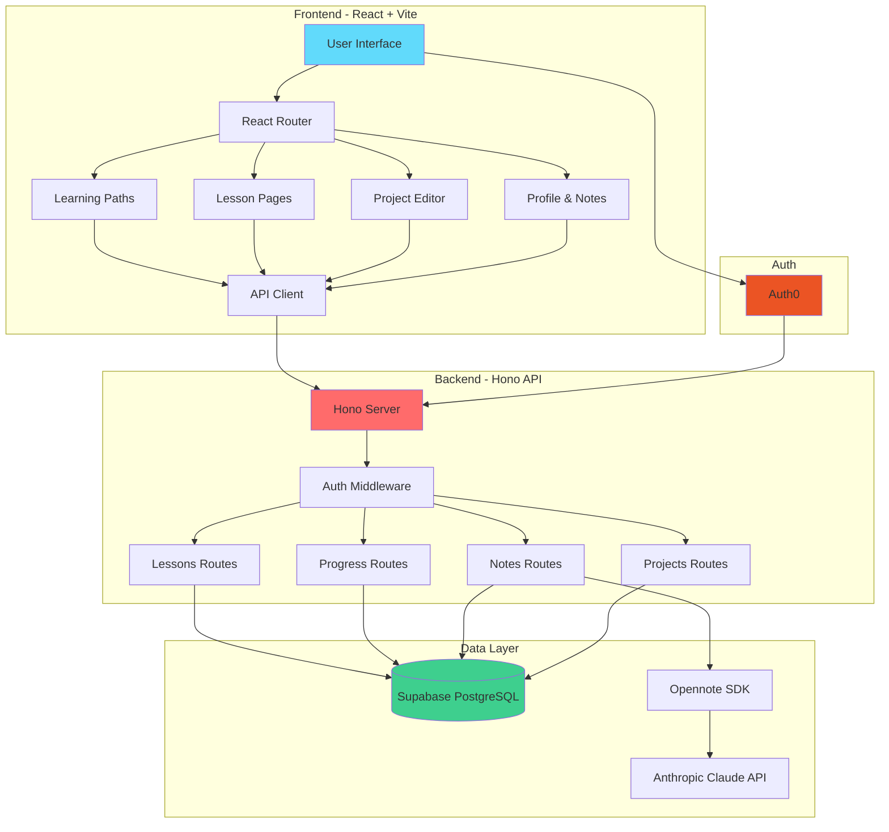

<div align="center">

# ⚡ HardwareHub

### *Learn Embedded Systems. Build Real Projects. No Barriers.*

**A next-generation interactive learning platform for embedded programming with ESP32, Arduino, and hardware modules.**

[](https://cruzhacks.com)
[](https://react.dev)
[](https://typescriptlang.org)
[](https://bun.sh)

[🚀 Live Demo](#) • [📖 Documentation](./SETUP.md) • [🎥 Video Demo](#) • [💬 Discord](#)

---

</div>

## 🎯 The Problem

Learning embedded systems is **hard**. Beginners face:
- 🚧 **Fragmented resources** scattered across forums and docs
- 📚 **Overwhelming complexity** with no clear learning path
- 🔌 **Hardware barriers** - you need expensive equipment to even start
- 😰 **No feedback loop** - code either works or silently fails

**HardwareHub solves this.**

---

## ✨ Our Solution

HardwareHub is a **comprehensive embedded learning platform** that takes you from complete beginner to building real IoT projects:

### 🎓 **Structured Learning Paths**
- **Getting Started** - Understand embedded systems fundamentals (no hardware needed!)
- **ESP32** - WiFi & Bluetooth IoT projects
- **Arduino** - Classic microcontroller programming
- **IF MAGIC** - Modular plug-and-play hardware system
- **Advanced** - Custom protocols, optimization, production-ready code

### 🧠 **AI-Powered Learning**
- **Smart Notes with Opennote** - Take notes during lessons, get AI-generated quizzes
- **Adaptive Content** - Unlock intermediate/advanced lessons as you progress
- **Personalized Recommendations** - AI suggests next steps based on your interests

### 🎨 **Visual Project Editor**
- **Drag-and-Drop Canvas** - Design hardware projects visually
- **Real-time Connections** - See how modules connect with animated circuit traces
- **Export to Code** - Generate starter code from your visual design

### 📊 **Progress Tracking**
- **Lesson Completion** - Track your journey through each learning path
- **Achievements & Streaks** - Stay motivated with gamification
- **Portfolio Builder** - Showcase your projects

---

## 🚀 Features

<table>
<tr>
<td width="50%">

### 🎯 **Smart Learning System**
- ✅ Role-based access control (beginner/intermediate/advanced)
- ✅ Unlock lessons as you progress
- ✅ Completion tracking & achievements
- ✅ AI quiz generation from your notes

</td>
<td width="50%">

### 🛠️ **Developer Experience**
- ✅ Hacker-themed UI with animated backgrounds
- ✅ Real-time note saving (localStorage + backend sync)
- ✅ Responsive design - works on mobile & desktop
- ✅ Auth0 authentication (SSO ready)

</td>
</tr>
<tr>
<td width="50%">

### 📝 **Content Library**
- ✅ 27+ comprehensive lessons
- ✅ Code examples for every module
- ✅ Video tutorials (coming soon)
- ✅ Interactive challenges

</td>
<td width="50%">

### 🎨 **Visual Tools**
- ✅ Drag-and-drop project designer
- ✅ Module connection visualization
- ✅ Circuit trace animations
- ✅ Export project diagrams

</td>
</tr>
</table>

---

## 🏗️ Tech Stack

### **Frontend** 
```
⚛️  React 19           - UI framework with latest features
⚡  Vite               - Lightning-fast build tool  
🎨  Tailwind CSS       - Utility-first styling
🧭  React Router       - Client-side routing
🔐  Auth0              - Authentication & authorization
📝  Opennote SDK       - AI-powered note-taking
🚀  Bun                - Fast JavaScript runtime
```

### **Backend**
```
🔥  Hono               - Ultra-fast web framework
🗄️  Supabase           - PostgreSQL database + auth
🦄  TypeScript         - Type-safe development
🚀  Bun                - Runtime & package manager
☁️  Vercel/Cloudflare  - Deployment platforms
```

### **APIs & Services**
```
🤖  Anthropic API      - Claude AI for quiz generation
🔐  Auth0              - User authentication
📝  Opennote           - Note-taking & AI features
🗄️  Supabase           - Database, storage, realtime
```

---

## 📦 Quick Start

### Prerequisites
- [Bun](https://bun.sh) v1.0+ installed
- [Supabase](https://supabase.com) account (free tier works!)
- [Auth0](https://auth0.com) account (optional, for auth)

### 🚀 One-Line Install
```bash
git clone https://github.com/yourusername/hardwarehub.git
cd hardwarehub
chmod +x setup.sh && ./setup.sh
```

The setup script will:
- ✅ Install all dependencies (frontend + backend)
- ✅ Guide you through Supabase setup
- ✅ Create environment files
- ✅ Initialize the database schema
- ✅ Start both dev servers

### 🔧 Manual Setup

<details>
<summary>Click to expand detailed setup instructions</summary>

#### 1️⃣ Clone & Install
```bash
git clone https://github.com/yourusername/hardwarehub.git
cd hardwarehub

# Backend
cd backend
bun install

# Frontend  
cd ../frontend/HardwareHub
bun install
```

#### 2️⃣ Setup Supabase
1. Create project at [supabase.com](https://supabase.com)
2. Go to **SQL Editor**
3. Copy & paste `backend/supabase-schema.sql`
4. Click **Run** to create all tables
5. Get your keys from **Project Settings → API**

#### 3️⃣ Environment Variables

**Backend** (`backend/.env`):
```env
SUPABASE_URL=https://xxxxx.supabase.co
SUPABASE_ANON_KEY=your_anon_key_here
SUPABASE_SERVICE_ROLE_KEY=your_service_role_key_here
AUTH0_DOMAIN=your-tenant.auth0.com
AUTH0_CLIENT_ID=your_auth0_client_id
AUTH0_CLIENT_SECRET=your_auth0_client_secret
ANTHROPIC_API_KEY=your_anthropic_key_here
PORT=3000
FRONTEND_URL=http://localhost:5173
```

**Frontend** (`frontend/HardwareHub/.env`):
```env
VITE_SUPABASE_URL=https://xxxxx.supabase.co
VITE_SUPABASE_ANON_KEY=your_anon_key_here
VITE_API_URL=http://localhost:3000
VITE_AUTH0_DOMAIN=your-tenant.auth0.com
VITE_AUTH0_CLIENT_ID=your_auth0_client_id
```

#### 4️⃣ Run Development Servers

**Terminal 1 - Backend:**
```bash
cd backend
bun run dev
# 🚀 Server running at http://localhost:3000
```

**Terminal 2 - Frontend:**
```bash
cd frontend/HardwareHub  
bun run dev
# 🎨 Frontend running at http://localhost:5173
```

#### 5️⃣ Create Your First User
1. Navigate to http://localhost:5173
2. Click **Sign Up**
3. Create account (stored in Supabase)
4. Start learning! 🎉

</details>

---

## 🗺️ Architecture



---

## 📂 Project Structure

```
hardwarehub/
├── 📱 frontend/HardwareHub/
│   ├── src/
│   │   ├── 🎨 components/          # Reusable UI components
│   │   │   ├── Layout.tsx         # Main app layout with nav
│   │   │   └── ModuleIcons.tsx    # Hardware module icons
│   │   ├── 📄 pages/               # Route components
│   │   │   ├── Home.tsx           # Landing with animated circuits
│   │   │   ├── LearningPaths.tsx  # Choose your path
│   │   │   ├── Learning.tsx       # Lesson track view
│   │   │   ├── Lesson.tsx         # Individual lesson page
│   │   │   ├── Notes.tsx          # Notes review page
│   │   │   ├── ProjectEditor.tsx  # Visual design canvas
│   │   │   ├── Projects.tsx       # Project gallery
│   │   │   └── Profile.tsx        # User profile & settings
│   │   ├── 🗂️ data/                # Static content
│   │   │   └── lessonData.ts      # All lesson content & logic
│   │   ├── 🔧 lib/                 # Utilities
│   │   │   └── api.ts             # Backend API client
│   │   └── 🎭 contexts/            # React contexts (Auth, etc.)
│   ├── public/                    # Static assets
│   └── package.json
│
├── 🖥️ backend/
│   ├── src/
│   │   ├── 🛣️ routes/              # API endpoints
│   │   │   ├── lessons.ts         # Lesson CRUD
│   │   │   ├── progress.ts        # Track completions
│   │   │   ├── notes.ts           # Note saving & AI quiz
│   │   │   ├── projects.ts        # Project management
│   │   │   └── users.ts           # User profiles
│   │   ├── 📚 lib/                 # Shared code
│   │   │   └── supabase.ts        # DB client setup
│   │   ├── 🏷️ types/               # TypeScript types
│   │   │   └── database.types.ts  # Supabase generated types
│   │   └── index.ts               # Server entry point
│   ├── supabase-schema.sql        # Database schema
│   └── package.json
│
├── 📝 Documentation/
│   ├── README.md                  # This file!
│   ├── SETUP.md                   # Detailed setup guide
│   └── IMPLEMENTATION_SUMMARY.md  # Tech decisions & architecture
│
└── 🛠️ Scripts/
    ├── setup.sh                   # Automated setup script
    └── *.sql                      # Database helper queries
```

---

## 🔌 API Reference

### 🎓 **Lessons**
```typescript
GET    /api/lessons              // Get all lessons
GET    /api/lessons/:id          // Get specific lesson
POST   /api/lessons              // Create lesson (admin)
PUT    /api/lessons/:id          // Update lesson (admin)
DELETE /api/lessons/:id          // Delete lesson (admin)
```

### 📊 **Progress**
```typescript
GET    /api/progress/user/:userId           // Get user's progress
POST   /api/progress/complete               // Mark lesson complete
GET    /api/progress/stats/:userId          // Get learning stats
```

### 📝 **Notes**
```typescript
GET    /api/notes/user/:userId              // Get all notes
GET    /api/notes/lesson/:lessonId/:userId  // Get notes for lesson
POST   /api/notes/save                      // Save/update note
DELETE /api/notes/:noteId                   // Delete note
POST   /api/notes/generate-quiz/:noteId     // AI quiz from notes
```

### 🎨 **Projects**
```typescript
GET    /api/projects/user/:userId           // Get user's projects
GET    /api/projects/:projectId             // Get project details
POST   /api/projects                        // Create project
PUT    /api/projects/:projectId             // Update project
DELETE /api/projects/:projectId             // Delete project
```

### 👤 **Users**
```typescript
GET    /api/users/:userId                   // Get user profile
POST   /api/users                           // Create user
PUT    /api/users/:userId                   // Update profile
GET    /api/users/:userId/achievements      // Get achievements
```

**Full API docs:** [Backend README](./backend/README.md)

---

## 🎨 Design System

### Color Palette (Hacker Theme)
```css
/* Primary Colors */
--bg-primary: #0a0e27;           /* Deep space blue */
--accent-green: #00ff87;          /* Matrix green */
--accent-cyan: #64ffda;           /* Cyber cyan */
--accent-blue: #00d9ff;           /* Neon blue */

/* Text Colors */
--text-primary: #e6f1ff;          /* Bright white */
--text-secondary: #8892b0;        /* Muted gray */

/* Interactive */
--card-border: rgba(0, 255, 135, 0.3);
--card-shadow: 0 0 20px rgba(0, 255, 135, 0.2);
```

### Typography
- **Primary Font:** JetBrains Mono (monospace)
- **Fallback:** 'Courier New', monospace

### Animations
- ⚡ Scanning grid background
- ✨ Pulsing circuit traces  
- 🌊 Flowing electricity effect
- 🎯 Smooth hover transitions

---

## 🗺️ Roadmap

### ✅ **Phase 1: MVP** (Completed)
- [x] Learning path system with 5 paths
- [x] 27+ comprehensive lessons
- [x] Progress tracking & completion
- [x] Note-taking functionality
- [x] Visual project editor
- [x] Hacker-themed UI
- [x] Supabase backend integration

### 🚧 **Phase 2: AI & Enhanced Learning** (In Progress)
- [ ] Auth0 authentication
- [ ] Opennote AI quiz generation
- [ ] "How to Use HardwareHub" learning path
- [ ] Video tutorials for each lesson
- [ ] Code playground (live embedded simulator)

### 🔮 **Phase 3: Community** (Planned)
- [ ] Project sharing & gallery
- [ ] User comments & discussions
- [ ] Leaderboards & competitions
- [ ] Mentor matching system
- [ ] Live coding sessions

### 🚀 **Phase 4: Advanced Features** (Future)
- [ ] Hardware kit marketplace integration
- [ ] Real hardware debugging tools
- [ ] Team projects & collaboration
- [ ] Certificate of completion (NFTs on Solana)
- [ ] Mobile app (React Native)

---

## 🤝 Contributing

We love contributions! Here's how you can help:

### 🐛 **Found a Bug?**
1. Check [Issues](https://github.com/yourusername/hardwarehub/issues) to see if it's reported
2. If not, [create a new issue](https://github.com/yourusername/hardwarehub/issues/new)
3. Include: steps to reproduce, expected vs actual behavior, screenshots

### ✨ **Want to Add a Feature?**
1. [Open a discussion](https://github.com/yourusername/hardwarehub/discussions) first
2. Fork the repo
3. Create a branch: `git checkout -b feature/your-feature-name`
4. Make your changes
5. Test thoroughly
6. Submit a PR with clear description

### 📚 **Improve Documentation?**
- Fix typos, clarify instructions, add examples
- Documentation PRs are always welcome!

### 💡 **Have an Idea?**
[Start a discussion](https://github.com/yourusername/hardwarehub/discussions) - we'd love to hear it!

---

## 🏆 Built With Love At

<div align="center">

### CruzHacks 2026 🦥

**UC Santa Cruz | January 2026**

Built by passionate developers who believe embedded systems education should be accessible to everyone.

---

### 👨‍💻 Team

[Your Name](https://github.com/yourusername) • [Team Member 2](#) • [Team Member 3](#) • [Team Member 4](#)

---

### 🙏 Acknowledgments

- **IF MAGIC** - Hardware documentation and inspiration
- **Anthropic** - Claude AI for quiz generation
- **Supabase** - Database infrastructure
- **Auth0** - Authentication services
- **Opennote** - AI-powered note-taking
- **CruzHacks** - For hosting an amazing hackathon

---

### 📜 License

MIT License - see [LICENSE](./LICENSE) for details

---

### ⭐ Show Your Support

If HardwareHub helped you learn embedded systems, give us a star! ⭐

It helps others discover the project and motivates us to keep improving.

[](https://github.com/yourusername/hardwarehub)

---

**Made with ⚡ and lots of ☕ at CruzHacks 2026**

</div>
